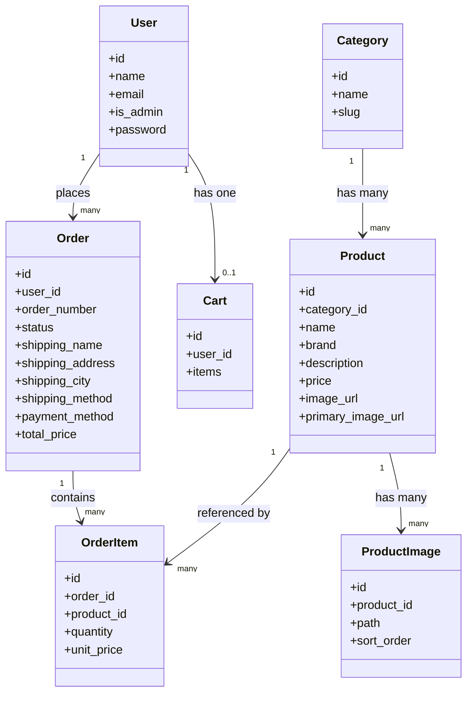

# UML Class Diagram

This diagram shows the core application entities and their main relationships.

## Notes

- `ProductImage` stores the gallery images for each product.
- `Product.primary_image_url` keeps the storefront views compatible with the older single-image setup.
- `Cart.items` is stored as JSON for authenticated users.
