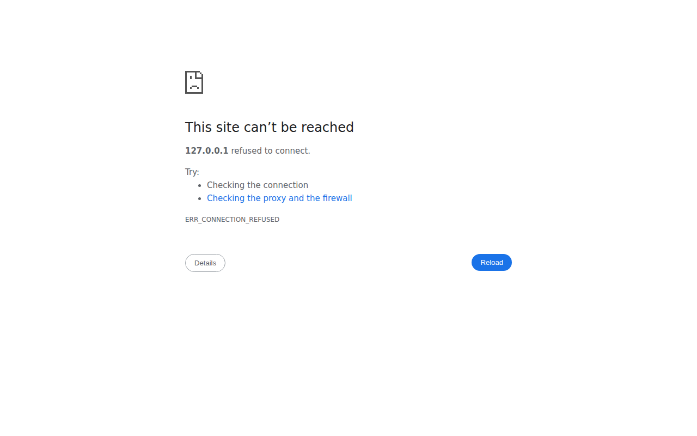
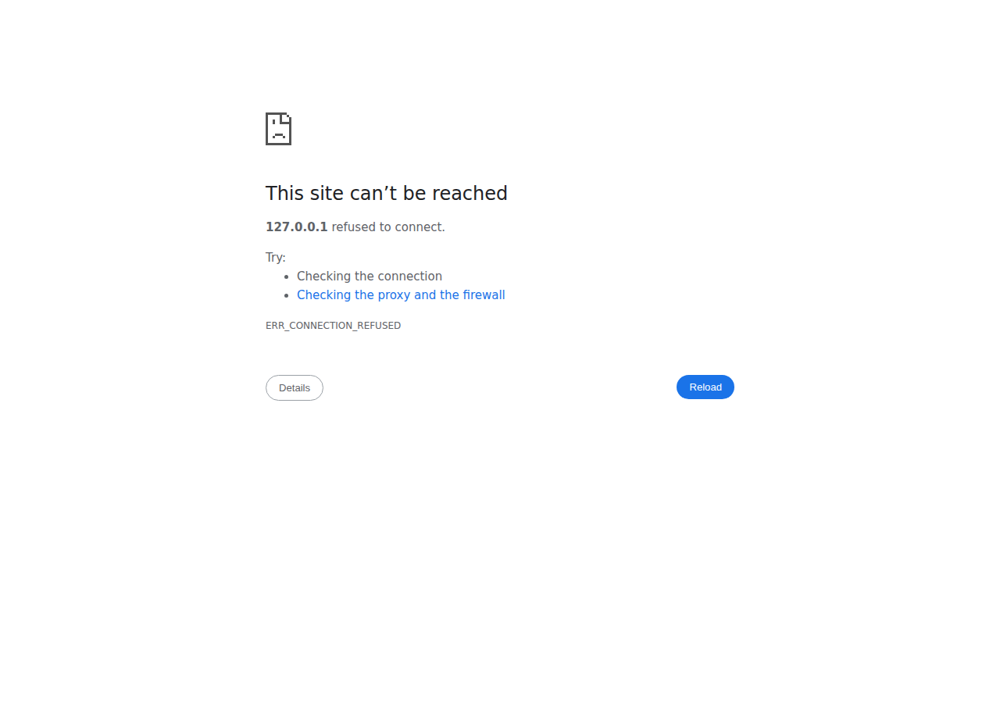

# ElectroHub — E-Commerce Project Documentation

## 1. Task

**Domain:** Electronics e-shop (laptops, accessories, mice, keyboards, monitors)

The goal of this semester project is to build a complete web-based e-shop application using the Laravel PHP framework. The application supports two types of users — **customers** and **administrators** — and covers the full shopping flow from product browsing to order placement.

---

## 2. Physical Data Model

```
┌──────────────┐       ┌──────────────────┐       ┌──────────────┐
│    users     │       │    cart_items    │       │   products   │
├──────────────┤       ├──────────────────┤       ├──────────────┤
│ id (PK)      │──┐    │ id (PK)          │    ┌──│ id (PK)      │
│ name         │  └───>│ user_id (FK,null)│    │  │ category_id  │──>┌─────────────┐
│ email        │       │ session_id (null)│    │  │ name         │   │ categories  │
│ password     │       │ product_id (FK)  │<───┘  │ slug         │   ├─────────────┤
│ role         │       │ quantity         │       │ description  │   │ id (PK)     │
│ remember_tok │       │ created_at       │       │ price        │   │ name        │
│ created_at   │       │ updated_at       │       │ stock        │   │ slug        │
│ updated_at   │       └──────────────────┘       │ color        │   │ created_at  │
└──────────────┘                                  │ image        │   │ updated_at  │
       │                                          │ created_at   │   └─────────────┘
       │              ┌──────────────┐            │ updated_at   │
       │              │    orders    │            └──────────────┘
       │              ├──────────────┤
       └─────────────>│ id (PK)      │       ┌──────────────────┐
                      │ user_id (FK) │       │   order_items    │
                      │ name         │       ├──────────────────┤
                      │ email        │──────>│ id (PK)          │
                      │ address      │       │ order_id (FK)    │
                      │ city         │       │ product_id(FK,nu)│
                      │ shipping_met.│       │ product_name     │
                      │ payment_meth │       │ unit_price       │
                      │ total        │       │ quantity         │
                      │ created_at   │       │ created_at       │
                      │ updated_at   │       │ updated_at       │
                      └──────────────┘       └──────────────────┘
```

**Changes from Phase 1:**
- Added `role` column to `users` (default `'customer'`, can be `'admin'`).
- New tables: `categories`, `products`, `cart_items`, `orders`, `order_items`.
- `cart_items.user_id` is nullable to support guest shopping carts identified by `session_id`.
- `order_items.product_id` is nullable (set null on product deletion) but `product_name` + `unit_price` are stored as a snapshot so order history is preserved even if the product is deleted.

---

## 3. Design Decisions

### 3.1 Framework & Libraries

| Library | Version | Reason |
|---|---|---|
| Laravel | 11.x | Required by the course; provides routing, ORM (Eloquent), sessions, validation, auth scaffolding |
| Bootstrap | 5.3 | Pre-existing CSS framework in the starter UI; kept for consistency, loaded via CDN |
| SQLite | — | Used as the local development database; zero-configuration, works out of the box with Laravel's default `.env.example` |

No external packages beyond what Laravel ships with were added. All JavaScript is vanilla (no npm/Vite build step), keeping the setup simple.

### 3.2 Authentication & Roles

Laravel's built-in session-based authentication (`Auth::attempt`, `Auth::check`) is used directly — no Breeze/Jetstream scaffolding was installed to keep control over the views and avoid unnecessary dependencies.

Role management is intentionally simple: a single `role` column (`'customer'` | `'admin'`) on the `users` table. A dedicated `AdminMiddleware` guards all `/admin/*` routes, checking `Auth::user()->role === 'admin'`. We chose **not** to use a full permissions package (e.g. Spatie Permission) because the app only has two clearly-defined roles and adding that dependency would be overkill for the project scope.

```
Guest        → public routes + cart (session) + checkout
Customer     → + /account, /orders, /wishlist, cart stored in DB
Admin        → + /admin/* (product CRUD)
```

### 3.3 Cart Portability

Guest cart is stored in the PHP session as `['product_id' => quantity, ...]`. Authenticated user cart is stored in the `cart_items` DB table keyed by `user_id`. 

**On login:** `CartService::mergeSessionCart()` is called immediately after `Auth::attempt` succeeds (inside `AuthenticatedSessionController::store`). It reads the session cart, upserts each item into the DB (incrementing if the product already exists in the user's DB cart), then clears the session cart.

This means a guest can add items to cart, log in, and continue shopping with all items preserved.

### 3.4 Cart Service (`App\Services\CartService`)

A single service class abstracts the two cart backends. All controllers (`CartController`, `CheckoutController`, `AuthenticatedSessionController`) receive it via dependency injection. The navbar partial resolves it from the service container (`app(\App\Services\CartService::class)->count()`) to show a live cart count.

### 3.5 Search

Full-text search is implemented with SQL `LIKE` queries across `products.name` and `products.description`. This is sufficient for the current product count. The search bar appears in the **top navigation bar** on every page and submits a `GET` request to `/products?search=...`, where the product list is already filterable. A dedicated `/search` page also exists for a focused search experience.

### 3.6 Image Handling

Product images are stored in `storage/app/public/products/` and symlinked to `public/storage/` via `php artisan storage:link`. On product deletion or image replacement, `Storage::disk('public')->delete($product->image)` physically removes the file from disk. Products without images fall back to a placeholder image URL.

### 3.7 Order Snapshots

`order_items` stores `product_name` and `unit_price` at the time of purchase. This ensures order history remains accurate even if the admin later edits or deletes a product.

---

## 4. Programming Environment

| Component | Value |
|---|---|
| PHP | 8.2+ |
| Laravel | 11.x |
| Database | SQLite (development) |
| Web server | `php artisan serve` (development) |
| CSS | Bootstrap 5.3.3 via CDN |
| JavaScript | Vanilla JS (no bundler/build step) |
| OS | Linux (tested on Ubuntu 22.04) |

**Setup:**
```bash
composer install
cp .env.example .env
php artisan key:generate
touch database/database.sqlite
php artisan migrate:fresh --seed
php artisan storage:link
php artisan serve
```

Seeded admin credentials: `admin@electrohub.com` / `password`  
Seeded customer credentials: `user@electrohub.com` / `password`

---

## 5. Implementation of Selected Use Cases

### 5.1 Changing the Quantity for a Given Product

In `cart.blade.php`, each cart row renders an `<input type="number">` inside a `<form method="POST" action="/cart/update">`. Decrement/increment buttons change the input value with inline JavaScript (no page reload needed to adjust the field, but the form still submits via POST for the actual update). `CartController::update()` calls `CartService::update($productId, $quantity)`; if quantity ≤ 0, it removes the item instead.

### 5.2 Logging In

1. User visits `GET /login` → `AuthenticatedSessionController::create()` → renders `login.blade.php`.
2. Form submits `POST /login` with CSRF token, email, password, optional `remember` checkbox.
3. `LoginRequest` validates the fields and rate-limits (5 attempts per minute via `RateLimiter`, keyed by email+IP).
4. `AuthenticatedSessionController::store()` calls `$request->authenticate()`, regenerates the session, calls `CartService::mergeSessionCart()`, then redirects to `/account`.

### 5.3 Searching

The search bar in the global navbar submits `GET /products?search=<query>`. `ProductController::index()` applies a `WHERE name LIKE %query% OR description LIKE %query%` scope when the `search` parameter is present, alongside any active category/price/color filters. Results are paginated (9 per page) using Laravel's built-in `paginate()` with `withQueryString()` so filter parameters are preserved across pages.

### 5.4 Adding a Product to the Cart

1. On any product card (list page) or product detail page, a `<form method="POST" action="/cart/add">` with a hidden `product_id` field is submitted.
2. `CartController::add()` validates `product_id` (must exist in `products` table) and optional `quantity`.
3. `CartService::add()` checks `Auth::check()`:
   - **Guest:** increments `session('cart')[$productId]`.
   - **Auth user:** upserts a `cart_items` row via `firstOrCreate` + `increment`.
4. The navbar cart count updates on the next request.

### 5.5 Pagination

`ProductController::index()` uses `->paginate(9)->withQueryString()`. The view calls `$products->links('pagination::bootstrap-5')` which renders Bootstrap-styled previous/next/page-number links. All active filters (category, max_price, color, sort) are automatically appended to pagination URLs via `withQueryString()`.

### 5.6 Basic Filtering

The sidebar filter form on `/products` sends radio buttons for `category`, a range slider for `max_price`, and a select for `color` as GET parameters. `ProductController::index()` builds the Eloquent query conditionally:

```php
if ($categorySlug) $query->whereHas('category', fn($q) => $q->where('slug', $categorySlug));
if ($maxPrice)     $query->where('price', '<=', $maxPrice);
if ($color)        $query->where('color', $color);
```

A sort select sends `?sort=price_asc|price_desc|name_asc` and the controller applies the corresponding `orderBy`.

---

## 6. Screenshots

> Screenshots are taken from the running application at `http://localhost:8080`.

### 6.1 Homepage


### 6.2 Product List (with filters & pagination)


### 6.3 Product Detail


### 6.4 Shopping Cart


### 6.5 Checkout


### 6.6 Login Page


### 6.7 Admin — Product List


### 6.8 Admin — Add/Edit Product


> **To generate screenshots:** start the server with `php artisan serve`, open the browser, and navigate to each page. Login credentials: `admin@electrohub.com` / `password`.
